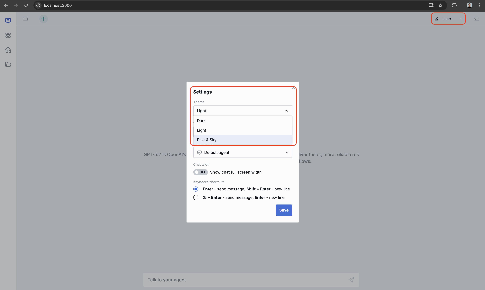
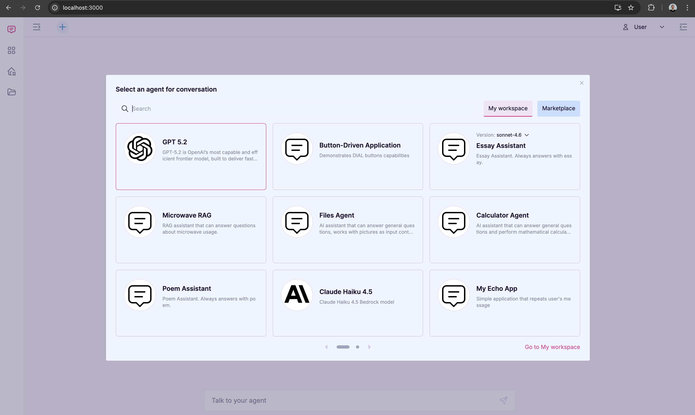

# Custom Themes

## This task is optional and intended primarily for Frontend Engineers!

DIAL Chat's appearance is fully customizable through themes. Each theme defines a complete color
palette for backgrounds, text, borders, and interactive controls. DIAL provides two built-in
themes — **Dark** (default) and **Light** — and you can add any number of custom themes by
editing the themes service configuration.

In this task you will add a **Pink & Sky** theme to your local DIAL environment.

---

## Steps

1. **Add a volume mount** to the `themes` service in `docker-compose.yml` to inject your local
   `themes-config.json` into the container:

   ```yaml
   volumes:
     - ./tasks/t8_themes/themes-config.json:/var/www/config.json:ro
   ```

   Final `themes` service block:
   ```yaml
   themes:
     image: epam/ai-dial-chat-themes:latest
     platform: linux/amd64
     ports:
       - "3001:8080"
     volumes:
       - ./tasks/t8_themes/themes-config.json:/var/www/config.json:ro
   ```

2. **Add the Pink & Sky theme** to [`themes-config.json`](themes-config.json) inside the
   `"themes"` array:

   ```json
   {
     "displayName": "Pink & Sky",
     "id": "pink-sky",
     "app-logo": "",
     "colors": {
       "bg-layer-0": "#FAFCFF",
       "bg-layer-1": "#F5F0FA",
       "bg-layer-2": "#EEF5FF",
       "bg-layer-3": "#FAFCFF",
       "bg-layer-4": "#C7DFFE",

       "bg-blackout": "#2A1A4A4D",
       "bg-error": "#F3D6D8",
       "bg-warning": "#FAF0CF",
       "bg-info": "#DBEEFF",
       "bg-success": "#D1FAE5",

       "bg-accent-primary": "#E8409A",
       "bg-accent-secondary": "#38B6F0",
       "bg-accent-tertiary": "#B56DF4",
       "bg-accent-primary-alpha": "#E8409A1A",
       "bg-accent-secondary-alpha": "#38B6F01A",
       "bg-accent-tertiary-alpha": "#B56DF41A",

       "bg-overlay": "#FAFCFF4D",

       "text-primary": "#1A1030",
       "text-secondary": "#8A8FA8",
       "text-error": "#C0323A",
       "text-warning": "#C49212",
       "text-info": "#38B6F0",
       "text-success": "#059669",
       "text-accent-primary": "#E8409A",
       "text-accent-secondary": "#1E9ED6",
       "text-accent-tertiary": "#9B4FE0",

       "stroke-primary": "#D4C8EC",
       "stroke-secondary": "#E2D8F5",
       "stroke-tertiary": "#EEF5FF",
       "stroke-hover": "#1A1030",
       "stroke-error": "#C0323A",
       "stroke-warning": "#C49212",
       "stroke-info": "#38B6F0",
       "stroke-success": "#059669",
       "stroke-accent-primary": "#E8409A",
       "stroke-accent-secondary": "#38B6F0",
       "stroke-accent-tertiary": "#B56DF4",

       "controls-bg-accent": "#E8409A",
       "controls-bg-accent-hover": "#C82D82",
       "controls-bg-disable": "#A0A5BE",
       "controls-text-permanent": "#FFFFFF",
       "controls-text-disable": "#D4C8EC",
       "bg-model-icon": "#FFFFFF"
     },
     "topicColors": {
       "bg-topic-default": "#E8409A1A",
       "stroke-topic-default": "#E8409A",
       "bg-topic-business": "#E8409A1A",
       "stroke-topic-business": "#E8409A",
       "bg-topic-development": "#38B6F026",
       "stroke-topic-development": "#38B6F0",
       "bg-topic-user-experience": "#FF4E7826",
       "stroke-topic-user-experience": "#FF4E78",
       "bg-topic-analysis": "#B56DF426",
       "stroke-topic-analysis": "#B56DF4",
       "bg-topic-sql": "#C7925A26",
       "stroke-topic-sql": "#C7925A",
       "bg-topic-sdlc": "#FAF0CF",
       "stroke-topic-sdlc": "#C49212",
       "bg-topic-talk-to-your-data": "#E8409A26",
       "stroke-topic-talk-to-your-data": "#E8409A",
       "bg-topic-rag": "#38B6F026",
       "stroke-topic-rag": "#1E9ED6",
       "bg-topic-text-generation": "#B56DF426",
       "stroke-topic-text-generation": "#B56DF4",
       "bg-topic-image-generation": "#FF6B0026",
       "stroke-topic-image-generation": "#FF6B00",
       "bg-topic-image-recognition": "#38B6F026",
       "stroke-topic-image-recognition": "#38B6F0"
     },
     "authColors": {
       "bg-auth-layer-0": "#FAFCFF",
       "bg-auth-layer-1": "#F0E8F8"
     }
   }
   ```

   > **Check that the JSON is valid** before saving. A syntax error in `themes-config.json`
   > silently prevents your custom theme from loading — DIAL Chat falls back to built-in
   > defaults without showing an error. Use VS Code's built-in validator or run:

3. **Restart the `themes` container** to pick up the updated config:

4. **Restart the `chat` service** so it re-fetches the theme list from the themes service:

5. **Test:** Open [DIAL Chat](http://localhost:3000) → click your user avatar (top right) →
   **Settings** → under **Theme** choose **Pink & Sky**

<details><summary>Result:</summary>




</details>

---

<details><summary>Pitfalls & Common Mistakes</summary>

### 1. Theme not appearing after adding to `themes-config.json`

The chat service caches the themes configuration for 24 hours. Simply changing the JSON file is
not enough — you must restart both the `themes` container **and** the `chat` service after every
change.

```bash
docker compose stop themes && docker compose up -d themes
docker compose restart chat
```

---

### 2. Invalid JSON silently falls back to built-in themes

A single missing comma or unmatched bracket prevents the entire `themes-config.json` from
loading. DIAL Chat shows no error — it just displays only the built-in Dark and Light themes.

---

### 3. Volume mount path is wrong

The path on the left side of `:` in the `volumes` entry must be relative to the location of
`docker-compose.yml` (the repo root). If the path is incorrect the container starts normally
but loads its built-in defaults instead of your file.

Correct — path relative to `docker-compose.yml`:

```yaml
volumes:
  - ./tasks/t8_themes/themes-config.json:/var/www/config.json:ro
```

Wrong — missing directory prefix, wrong mount target:

```yaml
volumes:
  - themes-config.json:/var/www/themes-config.json
```

---

### 4. `id` clashes with a built-in theme

Each theme must have a unique `id`. Using `"id": "dark"` or `"id": "light"` for a custom theme
will silently replace the built-in theme with the same ID. Always use a distinct slug, e.g.
`"pink-sky"`, `"ocean-blue"`.

</details>

---

## Optional Task: Create Your Own Theme

Design and register a completely custom color scheme:

1. In [`themes-config.json`](themes-config.json) add a new object to the `"themes"` array.
   Copy the **Pink & Sky** or **Light** theme as a starting point.

2. Choose your own `displayName`, a unique `id` slug, and replace the hex color values.

3. Think about visual consistency when picking colors:
   - `bg-layer-0` is the deepest background (page); `bg-layer-4` is the highest surface
     (floating panels, tooltips). For a light theme layers go from lightest to slightly darker;
     for a dark theme from darkest to lighter.
   - `bg-accent-primary` drives most interactive elements — buttons, links, active states —
     so it should stand out clearly against both `bg-layer-1` and `bg-layer-2`.
   - `text-primary` must have sufficient contrast against `bg-layer-2` for readability
     (WCAG AA requires a minimum ratio of 4.5:1 for normal text).

4. Restart both services and apply your theme in Chat Settings to verify it looks as expected:

   ```bash
   docker compose stop themes && docker compose up -d themes
   docker compose restart chat
   ```

> Tip: online tools such as [coolors.co](https://coolors.co) or
> [contrast-ratio.com](https://contrast-ratio.com) can help you build a harmonious palette and
> check text/background contrast ratios before committing to a set of hex values.
