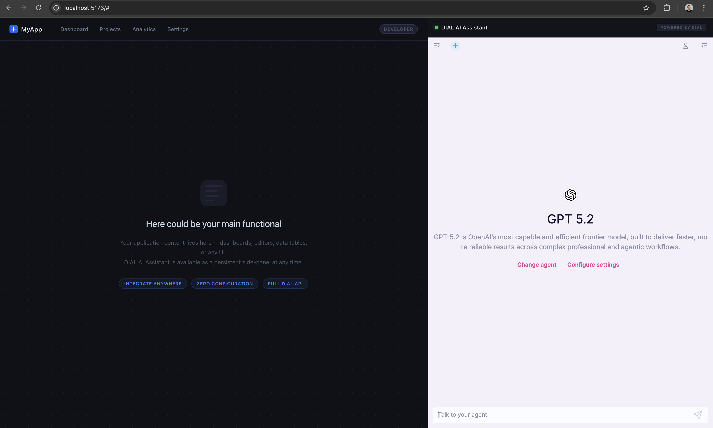

## Chat Overlay

## This task is optional and intended primarily for Frontend Engineers!

We integrate DIAL Chat into other applications with [Chat Overlay](https://docs.dialx.ai/tutorials/developers/chat/chat-design#overlay).

More details of [Chat Overlay](https://github.com/epam/ai-dial-chat/blob/development/libs/overlay/README.md)

1. Set env variables to `chat` service in [docker-compose.yml](/docker-compose.yml):
    - IS_IFRAME: true
    - ALLOWED_IFRAME_ORIGINS: http://localhost:5173/
2. Run in terminal:
   ```bash
   npm create vite@latest overlay-app 
   ```
   and choose options bellow:
    - project **Vanilla**
    - **js** (not ts)
    - **no** (just create project and that is all)
      After that you should be able to see the `overlay-app` folder [overlay-app](/overlay-app)
3. Run in terminal: 
   ```bash
   
   cd overlay-app
   ```
4. Run in terminal (to install base dependencies):
   ```bash
   npm i
   ``` 
5. Run in terminal (to install DIAL overlay library):
   ```bash
   npm i @epam/ai-dial-overlay
   ``` 
6. Replace content in [overlay-app/src/main.js](/overlay-app/src/main.js) to:
   ```js
   import './style.css'
   import { ChatOverlay } from "@epam/ai-dial-overlay";
   
   document.querySelector('#app').innerHTML = `
     <div class="main-panel">
       <header class="app-header">
         <div class="header-brand">
           <div class="brand-logo">
             <svg width="20" height="20" viewBox="0 0 20 20" fill="none" xmlns="http://www.w3.org/2000/svg">
               <rect width="20" height="20" rx="4" fill="#2563eb"/>
               <path d="M5 10h10M10 5v10" stroke="#fff" stroke-width="2" stroke-linecap="round"/>
             </svg>
             <span class="brand-name">MyApp</span>
           </div>
           <nav class="header-nav">
             <a href="#" class="nav-link">Dashboard</a>
             <a href="#" class="nav-link">Projects</a>
             <a href="#" class="nav-link">Analytics</a>
             <a href="#" class="nav-link">Settings</a>
           </nav>
         </div>
         <div class="header-actions">
           <span class="user-badge">Developer</span>
         </div>
       </header>
   
       <div class="main-content">
         <div class="placeholder-icon">
           <svg width="64" height="64" viewBox="0 0 64 64" fill="none" xmlns="http://www.w3.org/2000/svg">
             <rect width="64" height="64" rx="16" fill="#1e2130"/>
             <rect x="12" y="12" width="40" height="6" rx="3" fill="#2d3148"/>
             <rect x="12" y="24" width="28" height="6" rx="3" fill="#2d3148"/>
             <rect x="12" y="36" width="34" height="6" rx="3" fill="#2d3148"/>
             <rect x="12" y="48" width="20" height="4" rx="2" fill="#2d3148"/>
           </svg>
         </div>
         <h2 class="placeholder-title">Here could be your main functional</h2>
         <p class="placeholder-subtitle">
           Your application content lives here — dashboards, editors, data tables, or any UI.<br/>
           DIAL AI Assistant is available as a persistent side-panel at any time.
         </p>
         <div class="placeholder-tags">
           <span class="tag">Integrate anywhere</span>
           <span class="tag">Zero configuration</span>
           <span class="tag">Full DIAL API</span>
         </div>
       </div>
     </div>
   
     <aside class="chat-panel">
       <div class="chat-header">
         <div class="chat-header-left">
           <span class="status-dot"></span>
           <span class="chat-title">DIAL AI Assistant</span>
         </div>
         <span class="powered-badge">POWERED BY DIAL</span>
       </div>
       <div id="chat-container"></div>
     </aside>
   `;
   
   const container = document.querySelector('#chat-container');
   
   const run = async () => {
       const overlay = new ChatOverlay(container, {
           hostDomain: window.location.origin,
           domain: "http://localhost:3000",
           requestTimeout: 20000,
           enabledFeatures: [
               "conversations-section",
               "prompts-section",
               "top-settings",
               "top-clear-conversation",
               "top-chat-info",
               "top-chat-model-settings",
               "empty-chat-settings",
               "header",
               "footer",
               "request-api-key",
               "report-an-issue",
               "likes",
           ],
           loaderStyles: {
               background: "#13141a",
           },
       });
   
       await overlay.ready();
   };
   
   run();
   ```
   
7. Replace content in [overlay-app/src/style.css](/overlay-app/src/style.css) to:
   ```css
   /* ============================================================
      Reset & base
      ============================================================ */
   *, *::before, *::after {
     box-sizing: border-box;
     margin: 0;
     padding: 0;
   }
   
   html, body {
     height: 100%;
     overflow: hidden;
     font-family: system-ui, 'Segoe UI', Roboto, sans-serif;
     -webkit-font-smoothing: antialiased;
     -moz-osx-font-smoothing: grayscale;
     background: #0f1117;
     color: #94a3b8;
   }
   
   /* ============================================================
      Root layout — flex row splits viewport ~70 / ~30
      ============================================================ */
   #app {
     display: flex;
     flex-direction: row;
     height: 100%;
     width: 100%;
     overflow: hidden;
   }
   
   /* ============================================================
      Left panel — main application placeholder (~70%)
      ============================================================ */
   .main-panel {
     flex: 1 1 0;
     min-width: 0;
     display: flex;
     flex-direction: column;
     background-color: #0f1117;
     background-image: radial-gradient(circle, #1e2130 1px, transparent 1px);
     background-size: 28px 28px;
     overflow: hidden;
     position: relative;
   }
   
   /* Mock app header */
   .app-header {
     display: flex;
     align-items: center;
     justify-content: space-between;
     padding: 0 24px;
     height: 56px;
     flex-shrink: 0;
     background: rgba(15, 17, 23, 0.9);
     backdrop-filter: blur(8px);
     border-bottom: 1px solid #1e2130;
     position: relative;
     z-index: 1;
   }
   
   .header-brand {
     display: flex;
     align-items: center;
     gap: 32px;
   }
   
   .brand-logo {
     display: flex;
     align-items: center;
     gap: 8px;
   }
   
   .brand-name {
     font-size: 15px;
     font-weight: 600;
     color: #e2e8f0;
     letter-spacing: 0.3px;
   }
   
   .header-nav {
     display: flex;
     align-items: center;
     gap: 4px;
   }
   
   .nav-link {
     color: #64748b;
     text-decoration: none;
     font-size: 13px;
     font-weight: 500;
     padding: 6px 12px;
     border-radius: 6px;
     transition: color 0.15s, background 0.15s;
   }
   
   .nav-link:hover {
     color: #cbd5e1;
     background: #1e2130;
   }
   
   .header-actions {
     display: flex;
     align-items: center;
   }
   
   .user-badge {
     font-size: 11px;
     font-weight: 600;
     letter-spacing: 0.5px;
     text-transform: uppercase;
     color: #475569;
     background: #1e2130;
     border: 1px solid #2d3148;
     padding: 4px 10px;
     border-radius: 20px;
   }
   
   /* Centered placeholder content */
   .main-content {
     flex: 1 1 0;
     min-height: 0;
     display: flex;
     flex-direction: column;
     align-items: center;
     justify-content: center;
     gap: 20px;
     padding: 40px 60px;
     text-align: center;
   }
   
   .placeholder-icon {
     margin-bottom: 4px;
     opacity: 0.7;
   }
   
   .placeholder-title {
     font-size: 22px;
     font-weight: 500;
     color: #cbd5e1;
     letter-spacing: -0.3px;
     line-height: 1.3;
   }
   
   .placeholder-subtitle {
     font-size: 14px;
     line-height: 1.7;
     color: #475569;
     max-width: 460px;
   }
   
   .placeholder-tags {
     display: flex;
     gap: 10px;
     flex-wrap: wrap;
     justify-content: center;
     margin-top: 8px;
   }
   
   .tag {
     font-size: 11px;
     font-weight: 600;
     letter-spacing: 0.5px;
     text-transform: uppercase;
     color: #3b82f6;
     background: rgba(59, 130, 246, 0.08);
     border: 1px solid rgba(59, 130, 246, 0.2);
     padding: 5px 12px;
     border-radius: 20px;
   }
   
   /* ============================================================
      Right panel — DIAL chat sidebar (40%)
      ============================================================ */
   .chat-panel {
     width: 40%;
     flex-shrink: 0;
     display: flex;
     flex-direction: column;
     height: 100%;
     background: #13141a;
     border-left: 1px solid #1e2130;
     overflow: hidden;
   }
   
   .chat-header {
     display: flex;
     align-items: center;
     justify-content: space-between;
     padding: 0 16px;
     height: 48px;
     flex-shrink: 0;
     background: #13141a;
     border-bottom: 1px solid #1e2130;
   }
   
   .chat-header-left {
     display: flex;
     align-items: center;
     gap: 8px;
   }
   
   .status-dot {
     width: 8px;
     height: 8px;
     border-radius: 50%;
     background: #22c55e;
     box-shadow: 0 0 6px rgba(34, 197, 94, 0.6);
     flex-shrink: 0;
   }
   
   .chat-title {
     font-size: 13px;
     font-weight: 600;
     color: #e2e8f0;
     letter-spacing: 0.2px;
   }
   
   .powered-badge {
     font-size: 9px;
     font-weight: 700;
     letter-spacing: 1px;
     text-transform: uppercase;
     color: #475569;
     background: #1e2130;
     border: 1px solid #2d3148;
     padding: 3px 8px;
     border-radius: 4px;
   }
   
   /* CRITICAL: height chain must be fully computed for the iframe to render.
      min-height: 0 overrides flex's implicit min-height: auto,
      allowing the container to shrink and the iframe to fill it. */
   #chat-container {
     flex: 1;
     min-height: 0;
     overflow: hidden;
     display: flex;
     flex-direction: column;
     background: #13141a;
   }
   
   #chat-container iframe {
     width: 100% !important;
     height: 100% !important;
     border: none;
     display: block;
   }
   ```
   
8. Run in terminal (to run overlay app):
   ```bash
   npm run dev
   ```
9. Delete `chat` container and run it again (to fetch new env variables)

10. Open http://localhost:5173/ in browser and test it

<details><summary>Result samples</summary>



</details>